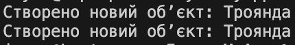

# Flyweight

Ідея легковаговика : 

ділиться спільними даними між багатьма об’єктами, щоб економити пам’ять.

Як працює код: 

Якщо потрібна ще одна “троянда”, фабрика повертає ту саму, а не створює нову.
Це корисно, коли є багато однотипних елементів — наприклад, тисячі квітів у каталозі.

Навіщо: 

зменшує витрати ресурсів при великій кількості однотипних об’єктів.

## Код
```csharp
class FlowerFactory
{
    private Dictionary<string, string> flowers = new Dictionary<string, string>();

    public string GetFlower(string type)
    {
        if (!flowers.ContainsKey(type))
        {
            flowers[type] = $"Створено новий об’єкт: {type}";
        }
        return flowers[type];
    }
}

class Program
{
    static void Main()
    {
        var factory = new FlowerFactory();

        Console.WriteLine(factory.GetFlower("Троянда"));
        Console.WriteLine(factory.GetFlower("Троянда")); // Використовує існуючий
    }
}
```
## Результат

